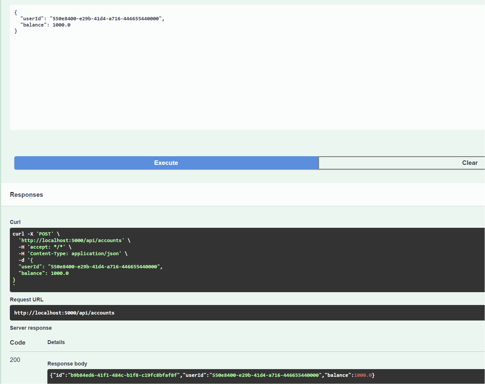
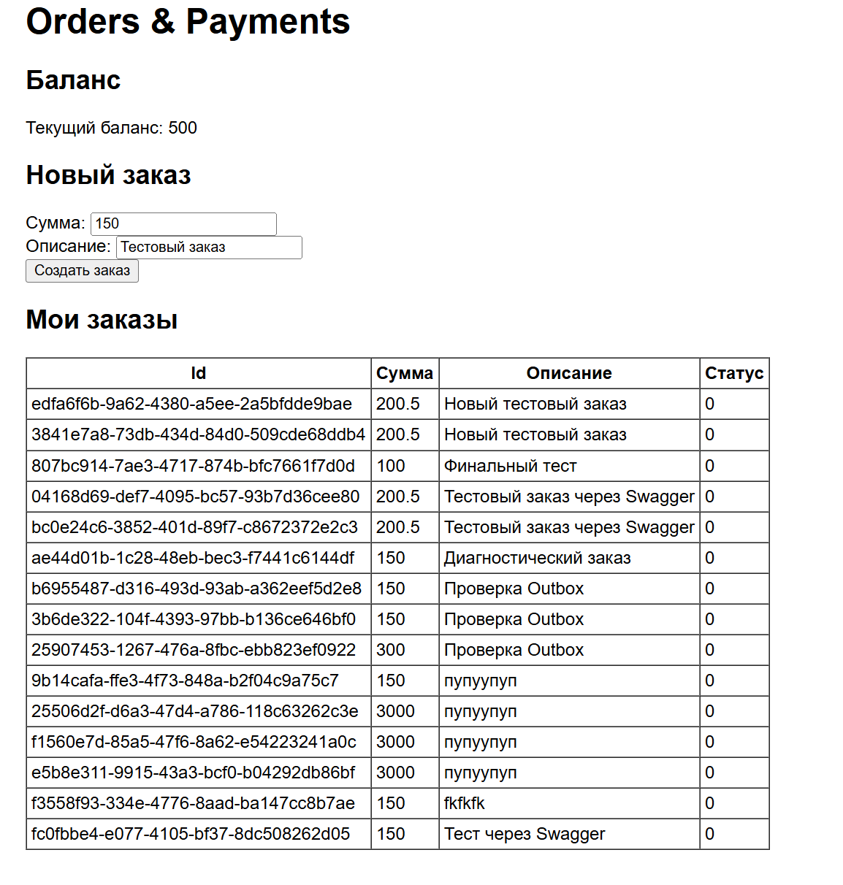
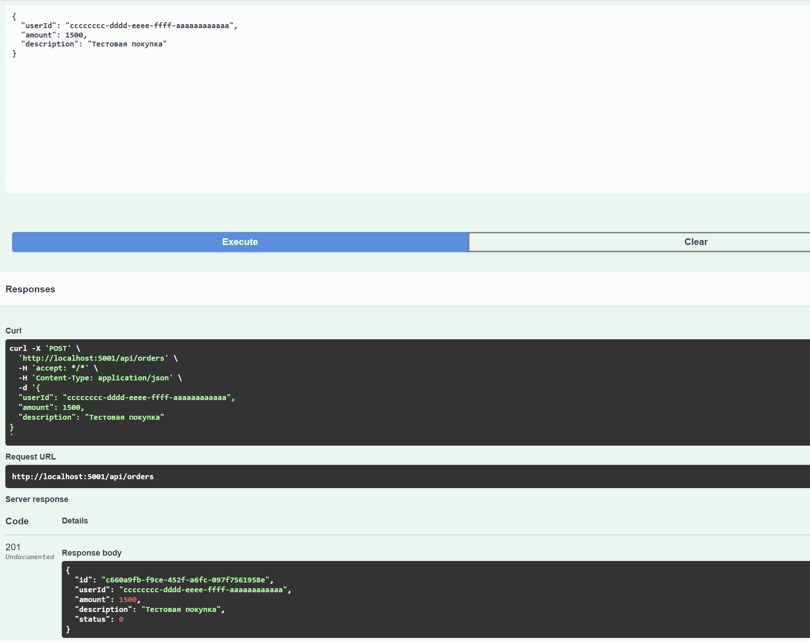
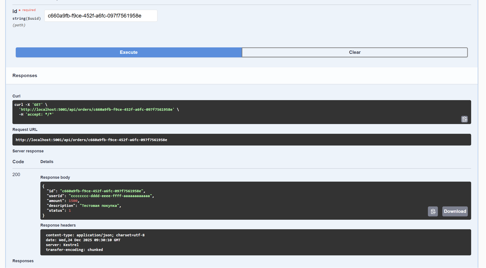
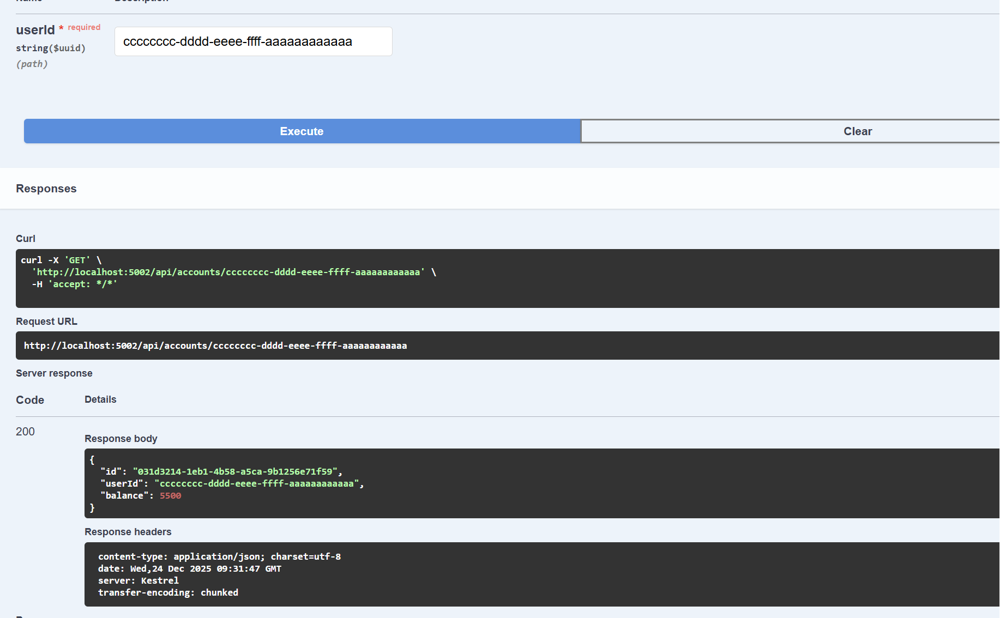
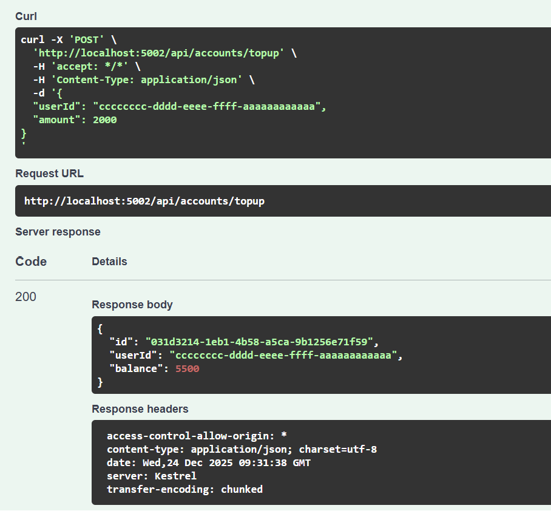

# KPO_DZ4
Москалевич Александр БПИ246
Учебный проект по микросервисной архитектуре: оформление заказов, обработка платежей и простой фронтенд.

## Архитектура

В проекте реализованы следующие сервисы:

- **OrdersService** - приём и хранение заказов, публикация событий `PaymentRequested` в RabbitMQ.
- **PaymentsService** - управление счётом пользователя, обработка событий `PaymentRequested`, списание средств и публикация `PaymentProcessed`.
- **API Gateway** - единая точка входа для REST‑запросов к бэкенду.
- **Frontend** - минимальное React/Vite‑приложение для работы пользователя.
- **PostgreSQL** - БД для OrdersService и PaymentsService.
- **RabbitMQ** - брокер сообщений между сервисами.

Сервисы запускаются через Docker Compose.

## Запуск

из корня репозитория
```
docker-compose up -d --build
```


После запуска доступны:

- OrdersService Swagger: http://localhost:5001/swagger  
- PaymentsService Swagger: http://localhost:5002/swagger  
- API Gateway: http://localhost:5000  
- Frontend: http://localhost:3000  

## Основные сценарии

1. **Пополнение счёта:**
   - В Swagger PaymentsService вызвать `POST /api/accounts/topup` для пользователя `123e4567-e89b-12d3-a456-426614174000`.

2. **Создание заказа:**
   - Через фронтенд (http://localhost:3000) или Swagger OrdersService `POST /api/orders`.

3. **Обработка платежа:**
   - OrdersService пишет событие в таблицу `OutboxEvents`.
   - Фоновый воркер публикует `PaymentRequested` в RabbitMQ.
   - PaymentsService списывает деньги и отправляет `PaymentProcessed`.
   - OrdersService обновляет статус заказа.


## Скриншоты



Страница фронтенда Orders & Payments.









Пополнение счёта (1).


Пополнение счёта (2).



